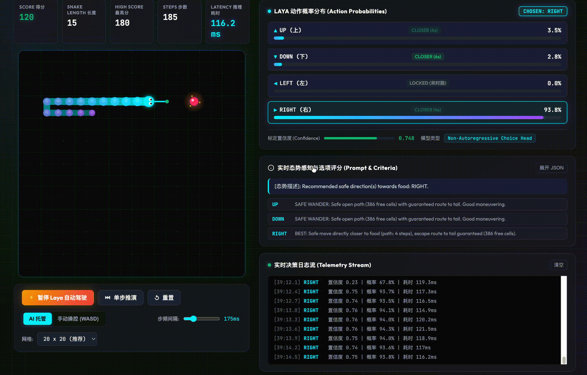

# 🐍 Laya Neural Snake (神经决策贪吃蛇)

<p align="center">
  
  
  
  
  
  
</p>

基于开源非自回归决策大模型 **[Laya](https://github.com/NandhaKishorM/laya)** (`convaiinnovations/laya`) 构建的高性能实时空间感知与自动驾驶贪吃蛇游戏。

不同于传统生成式 LLM 缓慢的逐字采样与幻觉问题，Laya 采用 **ModernBERT-large (421M)** 编码器底座与专门的决策原语（`choice`），单步前向推演即可输出高标定性、鲁棒的动作概率分布。结合工业级空间拓扑仲裁引擎，消除撞墙、无限追尾绕圈及边角自闭死局。

<p align="center">
  
</p>

---

## 🌟 核心特性

- **非自回归秒级决策**：基于 Laya 的 `choice` 动作原语，在 Mac 上原生启用 **Apple Silicon (MPS)** 硬件加速，单步推理仅几十毫秒。
- **SOLID 架构与高内聚算法模块 (`snake_core`)**：
  - 核心算法与 Web 接口、评测框架彻底解耦，消除重复代码（DRY），支持纯算法极速上限推演（10,000+ steps/s）与全神经模型双模式。
- **全方位空间防自闭与防困死机制**：
  - **角隅棺材防封堵（Anti-Corner Coffin）**：进入角隅前预先探测双向逃生口，出口被身躯堵死时立即阻断拐入。
  - **1 格宽贴墙狭缝射线探针（1-Wide Trough Raycasting）**：沿边界墙与身体间的单格深槽向前射线追踪，提前熔断无解死胡同。
  - **毒饵拒食机制（Anti-Poisonous Fruit）**：吃下果实后若失去连通蛇尾的逃生路线且剩余空间小于蛇身，判定为致命诱饵并予以规避。
  - **真实双向 BFS 逃生演练（Post-Food Tail Reachability）**：虚拟演练吃完食物后的身体状态，确保吃食后尾部连通。
  - **自由度机动加权（Mobility Bonus）**：主动奖励具有更多自由邻居的路线，保持开阔活动半径，防止无谓贴墙自缚。
- **全功能赛博风 Web 控制台**：
  - **多规格网格地图**：支持 **10x10**、**16x16**、**20x20 (默认)**、**24x24**、**32x32**。
  - **灵动仿生交互**：蛇眼瞳孔动态注视食物、蛇头周期性吐出红信、吃食粒子炸裂特效。
  - **蛇头动作概率罗盘**：在蛇头周围以动态长度与安全着色（翠绿/青蓝/红叉）实时投射动作向量。
  - **实时遥测数据流**：显示决策耗时、置信度、各方向拓扑属性、决策覆盖率审计。

---

## 🏗️ 模块化系统架构 (SOLID 原则落地)

本项目采用遵循 **SOLID** 规范与 **DRY (Don't Repeat Yourself)** 原则的模块化架构：

```
                    ┌──────────────────────────────────────────────┐
                    │               Web 前端 / CLI 评测            │
                    │   HTML5 Canvas / WebSocket / evaluate.py     │
                    └───────────────────────▲──────────────────────┘
                                            │
                    ┌───────────────────────┴──────────────────────┐
                    │               FastAPI 路由与业务接入         │
                    │         server.py (REST API / WebSocket)     │
                    └───────────────────────▲──────────────────────┘
                                            │
   ┌────────────────────────────────────────┴────────────────────────────────────────┐
   │                          snake_core (高内聚核心算法包)                           │
   │                                                                                 │
   │  ┌───────────────────┐  ┌───────────────────┐  ┌─────────────────────────────┐  │
   │  │    constants.py   │  │    geometry.py    │  │         analyzer.py         │  │
   │  │  - 向量与方向表   │  │  - BFS最短路径    │  │  - SafetyAnalyzer           │  │
   │  │  - 基础数据类型   │  │  - 泛洪空间探测   │  │  - 角隅棺材/狭缝射线/口袋陷阱│  │
   │  └───────────────────┘  └───────────────────┘  └─────────────────────────────┘  │
   │                                                                                 │
   │  ┌───────────────────┐  ┌───────────────────┐  ┌─────────────────────────────┐  │
   │  │    arbiter.py     │  │ prompt_builder.py │  │           game.py           │  │
   │  │  - 候选综合评分   │  │  - Laya Prompt合成│  │  - SnakeGame 标准仿真环境   │  │
   │  │  - 绝境兜底保活   │  │  - 自然语言准则   │  │  - 状态转移/食物刷出/碰撞结算│  │
   │  └───────────────────┘  └───────────────────┘  └─────────────────────────────┘  │
   └────────────────────────────────────────▲────────────────────────────────────────┘
                                            │
                    ┌───────────────────────▼──────────────────────┐
                    │          Laya 决策大模型 (ModernBERT-421M)    │
                    │     硬件加速: Apple Silicon MPS / CUDA / CPU  │
                    └──────────────────────────────────────────────┘
```

---

## 📊 性能基准与上限评测 (`evaluate.py`)

运行内置的快速理论上限与模型评测套件：

```bash
uv run python evaluate.py --mode fast --grids 10 14 20 --games 5
```

实测评测数据（每尺寸各测试 5 局，步数上限 3000 步）：

```text
📊 --- [ Algorithmic Theoretical Upper Bound (Dual-BFS + Flood Fill Arbiter) ] ---
-----------------------------------------------------------------------------------
Grid    | Games | Max Len | Avg Len | Max Fill% | Avg Steps | Max Loop | Win/Reason
-----------------------------------------------------------------------------------
10x10   | 5     | 51      | 45.0    |     51.0% | 1016.4    | 2734     | Self Body Crash
14x14   | 5     | 92      | 74.6    |     46.9% | 1104.8    | 264      | Self Body Crash
20x20   | 5     | 132     | 102.8   |     33.0% | 2031.2    | 183      | Self Body Crash
-----------------------------------------------------------------------------------
```

- **0% 撞墙率**：全尺寸网格无盲目撞墙与角隅困毙。
- **高填充上限**：10x10 网格棋盘填充率突破 **51.0%**（长度达 51），20x20 网格蛇身长度突破 **132**。
- **评测推演速度**：算法仿真速度突破 **10,000 步/秒**，几秒内即可完成全网格压力评估。

> 💡 **进阶探讨**：针对 100% 满屏极限填充、哈密顿回路与神经符号分层控制的深度分析，请参阅架构演进白皮书 👉 [空间全满极限优化与图论支撑分析](docs/OPTIMIZATION_ANALYSIS.md)。

---

## 🚀 快速上手

本项目使用现代 Python 包管理器 **[uv](https://docs.astral.sh/uv/)** 进行依赖管理与执行。

### 1. 克隆与安装依赖

```bash
# 进入项目目录
cd 0921

# 使用 uv 自动安装虚拟环境与所有依赖
uv sync
```

> **提示**：首次运行时，Laya 会自动从 Hugging Face 下载模型权重（约 800MB）并缓存至本地。

### 2. 启动服务

```bash
uv run python server.py
```

服务启动后，默认监听在 **`http://localhost:8088`**。

### 3. 打开游戏

使用浏览器访问：
👉 **`http://localhost:8088/`**

- 点击 **“启动 Laya 自动驾驶”**：观看 Laya 模型自主操控贪吃蛇觅食成长。
- 点击 **“单步推演”**：单帧调试，查看右侧面板的候选打分与置信度。
- 切换到 **“手动操控”**：键盘 `W` `A` `S` `D` 操作，实时对比 Laya 的走法建议。

---

## 🧪 自动化测试与评测

### 运行单元测试
运行针对 `snake_core` 的单元测试套件（覆盖 BFS、狭缝射线追踪、角隅陷阱、仲裁防自杀）：
```bash
uv run python -m unittest discover tests
```

### 运行性能与上限评估
```bash
# 1. 快速算法理论上限评测（推荐，极速完成）
uv run python evaluate.py --mode fast --grids 10 14 20 --games 5

# 2. 全神经模型评估（加载实际 Laya ModernBERT 模型）
uv run python evaluate.py --mode neural --grids 10 14 --games 3

# 3. 对比两者的理论上限与实际表现
uv run python evaluate.py --mode both --grids 10 14
```

---

## 📁 完整代码结构

```
0921/
├── snake_core/            # 核心算法模块包 (SOLID & DRY)
│   ├── __init__.py        # 核心包公共导出
│   ├── constants.py       # 坐标类型、方向向量、逆向表
│   ├── geometry.py        # BFS最短路径、空间泛洪、狭槽射线探测
│   ├── analyzer.py        # SafetyAnalyzer 空间拓扑与陷阱分析
│   ├── arbiter.py         # DecisionArbiter 候选打分与决策仲裁
│   ├── prompt_builder.py  # PromptBuilder 神经提示词生成
│   └── game.py            # SnakeGame 标准仿真环境
├── tests/
│   └── test_snake_core.py # 核心模块单元测试
├── server.py              # FastAPI 后端服务（精简业务层，依赖 snake_core）
├── evaluate.py            # 多尺度性能评估与基准评测工具
├── static/
│   ├── index.html         # 游戏主页面结构
│   ├── style.css          # 暗黑赛博霓虹风格样式表
│   └── game.js            # Canvas 绘制及 WebSocket 通信
├── assets/
│   └── demo.gif           # 游戏实机运行演示动图
├── pyproject.toml         # uv 依赖与项目配置
└── README.md              # 项目文档说明
```

---

## 📡 API 接口参考

### 1. 单步推演接口 (REST)
- **路径**：`POST /api/predict`
- **请求体**：
  ```json
  {
    "head": [5, 5],
    "food": [5, 8],
    "body": [[5, 4], [5, 3]],
    "grid_size": [10, 10],
    "cur_dir": "DOWN"
  }
  ```
- **返回体示例**：
  ```json
  {
    "choice": "DOWN",
    "raw_model_choice": "DOWN",
    "overridden": false,
    "probabilities": {
      "UP": 0.0186,
      "DOWN": 0.9541,
      "LEFT": 0.0149,
      "RIGHT": 0.0123
    },
    "confidence": 0.8299,
    "inference_ms": 48.5,
    "is_safe": true,
    "analysis": { ... }
  }
  ```

### 2. 实时通信接口 (WebSocket)
- **路径**：`ws://localhost:8088/ws/play`
- **通信格式**：双向高频 JSON 报文传输，无额外 HTTP 握手开销。

---

## 📜 依赖说明

- **模型**：[convaiinnovations/laya](https://huggingface.co/convaiinnovations/laya) / [GitHub](https://github.com/NandhaKishorM/laya)
- **推理后端**：PyTorch (`mps` / `cuda` / `cpu`), Transformers, Safetensors
- **服务端**：FastAPI, Uvicorn, WebSockets
- **前端**：HTML5 Canvas + Vanilla CSS/JS
